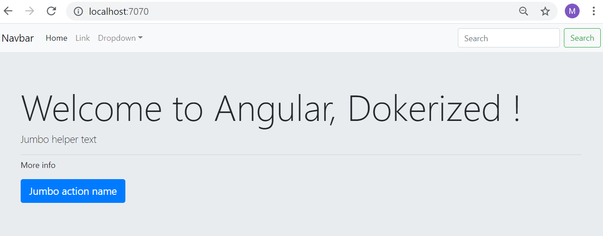

# Dockerize an Angular frontal web application

In this step we will learn how to dockerize an Angular 9 frontal web application. Angular is a platform for building mobile and desktop web applications. It is generally used as the presentation tier of full stack applications. The backend tier of these application is generallt composed of a web api that performs the business logic. This backend can be build using Spring Boot framework, Nodejs/express, Python, ...

Navigate folder  `starter-dockerize-angular-app` containing an example of simple Angular application generated using the Angular CLI. Open the application using Visual Studio Code.

 - Add the following minimal `.dockerignore` file to the project folder.

```
node_modules
npm-debug.log
Dockerfile*
docker-compose*
.dockerignore
.git
.gitignore
README.md
LICENSE
.vscode

dist/node_modules
dist/npm-debug.log
```

  > **Note**: The Docker extension for Visual Studio Code can generate blueprints for the various docker files (.dockerignore, Dockerfile, docker-compose, ...) 

- Add the following `Dockerfile` file to the project folder. We are going to dockerize the Angular Application using Multi-stage Docker Image build. We'll use **Node Docker Image** as Build and **Nginx Docker Image** as final Docker Image where we'll be using the output for Node Container in the Ngnix Docker Image.
   1. Stage 1: Build a Docker Image for Angular Application as Build Stage
   2. Stage 2: Using the Application Build from Angular Docker Container in the Nginx Docker Image


```dockerfile
### STAGE 1: Build
FROM node:12.7-alpine AS build
WORKDIR /app
COPY package*.json ./
RUN npm install
COPY . /app
RUN npm run build --prod

### STAGE 2: Run
FROM nginx:1.17.1-alpine
COPY --from=build /app/dist/MyAngularApp /usr/share/nginx/html
```

- Now, we are all set to build a multi-stage Docker Image. We can build using the following command.
```shell
$ docker build -t my-simple-angular-image .
```
`RUN npm install` and `RUN npm build --prod` are the most time consuming instructions. Check that the image has been generated successfully using the command `docker image ls`.

- Run a Docker Container using our newly created Angular App Image `my-simple-angular-image`. You can run the container either in interactive mode or detached mode. In the interactive mode, you can see the log messages.
   - **Interactive Mode**: To run Docker Container in interactive mode, use the following command. 
    ```shell
      $ docker run -it --rm -p 7070:80 --name my-first-angular-container my-simple-angular-image
    ```   
   Use `--rm` so Docker Container will be removed automatically when we stop the Container. We will bind the Container Port 80 to our Local Port 7070 so that we can access the Container from our machine and name the Container as "my-first-angular-container". We can browse our Application on http://localhost:7070/. The screen shot of the application looks like the following:
   
   

  - **Detached Mode**: To run Docker Container in detached mode, use the following command. 
      ```shell
        $ docker run -d --rm -p 9090:80 --name my-first-angular-container my-simple-angular-image
      ``` 
    We can check that the container is running using `docker ps`. We can follow the logs using the command `docker logs --follow my-first-angular-container`. We can browse our Application on http://localhost:9090/  

